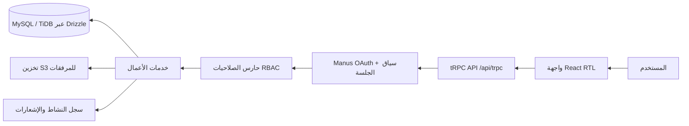
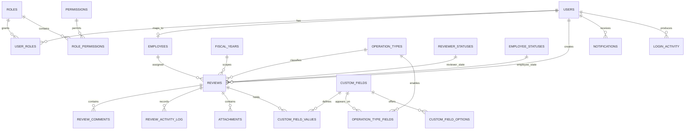
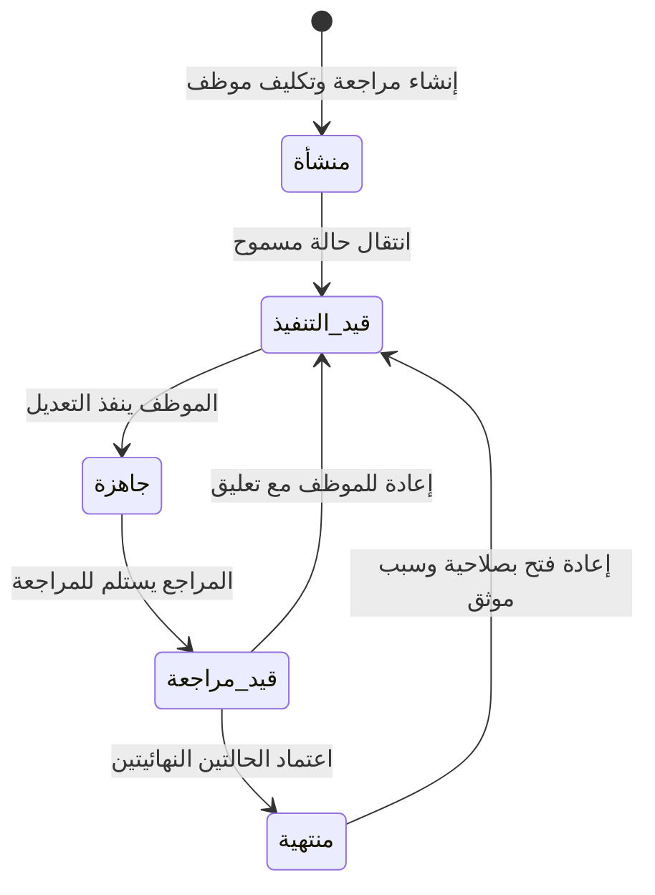

# البنية التنفيذية — نظام المراجعة المبسط

## 1. القرار المعماري

يستخدم المشروع بنية تطبيق ويب كامل من ثلاث طبقات مترابطة: واجهة React عربية RTL، وخادم Express يقدّم إجراءات tRPC محمية، وقاعدة بيانات MySQL/TiDB عبر Drizzle ORM. تُعامل إجراءات tRPC كعقود API موحّدة ومكتوبة النوع، وتُطبق المصادقة والتفويض في الخادم قبل أي قراءة أو كتابة للبيانات. لا تتصل الواجهة بقاعدة البيانات مباشرة، ولا يُعتمد إخفاء عناصر الواجهة كوسيلة أمان.

تُخزن التواريخ في قاعدة البيانات بتوقيت UTC وتُعرض بالتوقيت المحلي للمستخدم. يُمرر `fiscalYearId` داخل كل استعلام أعمال ذي نطاق سنوي، وتتحقق طبقة الخدمة من حق المستخدم في السنة المطلوبة وحالة السنة (مفتوحة أو مغلقة) قبل تنفيذ التعديل.

## 2. نموذج البيانات والعلاقات

يعتمد النموذج على معرفات رقمية داخلية وعلاقات خارجية صريحة. رقم المراجعة الداخلي نص فريد بصيغة `REV-{السنة}-{تسلسل}`؛ رقم السند اختياري ولا يستخدم مفتاحًا للربط. لا تُضاف أعمدة حقيقة إلى جدول `reviews` عند إنشاء حقول مخصصة؛ بل تحفظ القيم في جدول مستقل مرتبط بالتعريف.

| المجموعة | الجداول | الغرض الأساسي |
|---|---|---|
| الهوية والتحكم | `users`, `employees`, `roles`, `permissions`, `user_roles`, `role_permissions`, `login_activity` | ربط الهوية الموثقة من OAuth بموظف وأدوار وصلاحيات فعلية قابلة للتوسعة. |
| مرجعيات الأعمال | `fiscal_years`, `operation_types`, `reviewer_statuses`, `employee_statuses`, `status_transitions` | إعداد سنوات وأنواع وحالات ديناميكية وقواعد انتقال الحالات. |
| عمليات المراجعة | `reviews`, `review_comments`, `review_activity_log`, `attachments` | سجل المراجعة الرئيسي والتواصل وسجل التدقيق وبيانات المرفقات. |
| التوسعة | `custom_fields`, `custom_field_options`, `operation_type_fields`, `custom_field_values` | تعريف الحقول المرنة، خيارات القوائم، ربطها بالأنواع، وحفظ القيم. |
| التجربة والمتابعة | `notifications`, `user_preferences` | إشعارات داخلية وتفضيلات العرض لاحقًا دون تغيير في النواة. |

الحقول المحورية في `reviews` هي: `internalRef`، و`fiscalYearId`، و`operationTypeId`، و`reviewerStatusId`، و`employeeStatusId`، و`assignedEmployeeId`، و`priority`، و`dueDate`، و`createdByUserId`، و`updatedByUserId`، و`completedAt`، و`deletedAt`. ستحتوي الجداول المرجعية على `active` و`sortOrder`، بينما ستحتوي الحالات على `isTerminal` و`color` لتحديد الدلالة السلوكية والبصرية من البيانات.

## 3. العزل السنوي وسلامة البيانات

كل عملية مراجعة تنتمي إلى سنة مالية واحدة فقط. تُضاف فهارس منفردة على السنة والحالات والنوع والموظف والتواريخ والأولوية، وفهارس مركبة توافق مسارات البحث الأكثر شيوعًا: `(fiscalYearId, operationTypeId)`، و`(fiscalYearId, reviewerStatusId)`، و`(fiscalYearId, employeeStatusId)`، و`(fiscalYearId, assignedEmployeeId)`، و`(fiscalYearId, deletedAt, createdAt)`.

تحتوي السنة المالية على `isCurrent` و`status` بقيمتي `open` و`closed`. يمنع الخادم إنشاء المراجعات وتعديلها وحذفها المنطقي واستعادتها وتغيير الحالات داخل سنة مغلقة، باستثناء إجراء إداري موثق لإعادة فتح السنة عند وجود صلاحية صريحة. لا تحذف المرجعيات المستخدمة تاريخيًا؛ بل تعطل لتختفي من نماذج الإدخال الجديدة وتظل قابلة للقراءة في السجلات السابقة.

## 4. دورة حياة عملية المراجعة

تمثل هذه الدورة لغة عمل افتراضية، وليست ثوابت في الكود. يقرأ الخادم قواعد الانتقال من `status_transitions` ويتحقق من جهة الحالة (مراجع أو موظف)، ومن الحالة الحالية، والحالة الهدف، والدور الذي ينفذ الحركة. لا تعتبر العملية مكتملة إلا حين تكون حالة المراجع وحالة الموظف نهائيتين. يسجل كل تغيير حالة في `review_activity_log` مع القيمة السابقة والجديدة والفاعل والتوقيت.

## 5. مصفوفة RBAC

الأدوار الافتراضية قابلة للتخصيص عبر الصلاحيات الدقيقة. يفحص Backend الصلاحية في كل إجراء بالإضافة إلى فحوصات النطاق؛ مثل ملكية الموظف للعملية المكلّف بها، أو حق المراجع في وحدته/سنته.

| الإجراء | مدير النظام | مدير | مراجع | موظف |
|---|:---:|:---:|:---:|:---:|
| إدارة المستخدمين والأدوار والصلاحيات | كامل | لا | لا | لا |
| إدارة السنوات وإغلاقها | كامل | عرض | لا | لا |
| إدارة الأنواع والحالات وانتقالات الحالة | كامل | وفق منح الصلاحية | لا | لا |
| إنشاء المراجعات وتعديلها | كامل | كامل | ضمن النطاق | لا |
| عرض كل المراجعات | كامل | ضمن النطاق | ضمن النطاق | المكلّف بها فقط |
| تغيير حالة المراجع | كامل | وفق منح الصلاحية | ضمن النطاق | لا |
| تغيير حالة الموظف | كامل | وفق منح الصلاحية | وفق منح الصلاحية | المكلّف بها فقط |
| تغيير الموظف المكلّف | كامل | كامل | وفق منح الصلاحية | لا |
| التعليق ورفع مرفق | كامل | كامل | ضمن النطاق | المكلّف بها فقط |
| حذف منطقي واستعادة | كامل | وفق منح الصلاحية | لا | لا |
| التقارير والتصدير | كامل | كامل | وفق منح الصلاحية | أعماله فقط عند المنح |

## 6. خريطة API (tRPC)

تُقسم واجهة API إلى نطاقات، وتُستدعى من الواجهة عبر `trpc.*`. تطبق الإجراءات المحمية مصادقة الجلسة أولًا، ثم تحقق الصلاحية، ثم تفرض العزل السنوي ونطاق الرؤية. تدعم قوائم المراجعات المعاملات `page` و`pageSize` و`sortBy` و`sortDirection` و`query` والفلاتر المركبة.

| النطاق | الإجراءات الأساسية |
|---|---|
| `auth` | `me`, `logout` |
| `users` | `list`, `get`, `create`, `update`, `setRoles`, `setFiscalYears`, `activity` |
| `roles` | `list`, `create`, `update`, `setPermissions` |
| `fiscalYears` | `list`, `create`, `update`, `setCurrent`, `close`, `reopen` |
| `settings` | `operationTypes.*`, `reviewerStatuses.*`, `employeeStatuses.*`, `statusTransitions.*` |
| `reviews` | `list`, `get`, `create`, `update`, `changeStatus`, `assign`, `remove`, `restore`, `export` |
| `comments` | `list`, `create`, `reply` |
| `attachments` | `requestUpload`, `list`, `remove`, `getAccessUrl` |
| `customFields` | `list`, `create`, `update`, `disable`, `setOptions`, `setOperationTypes` |
| `dashboard` | `overview`, `summary`, `employeePerformance` |
| `notifications` | `list`, `markRead`, `markAllRead` |

## 7. هيكل الواجهة

تستخدم الواجهة تخطيط لوحة إدارية RTL بقائمة جانبية ثابتة على سطح المكتب ودرج قابل للفتح على الجوال. الصفحات الأساسية هي: لوحة المراجعة، مراجعاتي، تفاصيل المراجعة، Dashboard، الخلاصة والتصدير، الإعدادات (السنوات، الأنواع، الحالات، الحقول المخصصة)، المستخدمون والأدوار، والإشعارات. في الجوال تتحول قائمة الجدول إلى بطاقات تحافظ على رقم المراجعة والنوع والأولوية والحالتين والموظف والتاريخ المستهدف، بينما تظهر التفاصيل في صفحة مستقلة قابلة للتمرير.

## 8. حدود الإصدار الأول

يشمل الإصدار الأول كل المسارات المطلوبة لتشغيل دورة العمل اليومية، لكن لا يرسل بريدًا أو رسائل خارجية، ولا يفعّل PDF إداريًا متقدمًا أو فلاتر محفوظة أو وضعًا ليليًا. تُنشأ بنية البيانات والأحداث اللازمة لهذه الميزات حتى تتم إضافتها لاحقًا دون تعديل جوهري في نموذج البيانات أو API.
